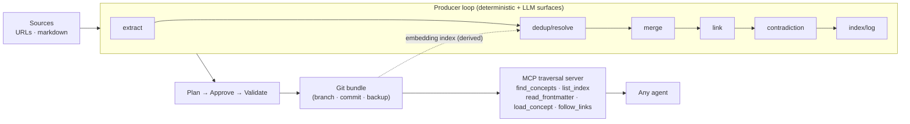

# Kosha

**Curated knowledge, kept alive.**

[](https://pypi.org/project/kosha-okf/)
[](https://pypi.org/project/kosha-okf/)
[](https://github.com/Mathews-Tom/Kosha/actions/workflows/ci.yml)
[](LICENSE)

> Kosha (Sanskrit: कोश, pronounced *koh-shah*) — a traditional term for a treasury or lexicon: a curated vessel of knowledge.

Kosha is a **verifiable, auditable maintenance layer for [OKF](https://openknowledgeformat.com) knowledge bundles**. It keeps an organization's knowledge coherent as it grows and gives connected agents — Claude, Gemini, a local model — a curated corpus to answer from, with a machine-verifiable governance guarantee: **knowledge is never silently overwritten, and every change is replayable.**

What sets it apart is enforced in code, not asked of a model:

1. **No silent overwrites, by construction.** Updates *supersede* prior claims — append-only, content-addressed — instead of editing prose in place; `assert_no_silent_overwrite` makes the guarantee checkable and the full claim lineage reconstructable.
2. **A replayable audit trail.** Every ingest lands on its own Git branch as a reviewable commit — deduplicated, cross-linked, contradiction-flagged — and nothing reaches `main` without a human merge.
3. **Traversal-first consumption.** The MCP server exposes deterministic traversal tools (table of contents → frontmatter → the minimal concept set) and no raw-text search endpoint. File-based fallbacks provide the same traversal instructions, but a host agent with generic filesystem tools is not sandboxed by Kosha today.

The unit Kosha produces is a **conformant OKF bundle**: a directory of Markdown concepts plus `index.md`/`log.md`, portable and tool-neutral by construction. Delete Kosha and the bundle still works in any editor or agent.

---

## Status

Version `0.1.0`.

**Internal self-consistency gate** — these deterministic toy-provider figures verify reproducible mechanics on the bundled reference corpus (`bundles/northwind`), not a claim of real-world RAG outperformance or real-model decision quality. Currently **passes**:

<!-- kosha:sync:start readme-acceptance-table -->
| Criterion | Result |
|---|---|
| Hybrid token cost < RAG (at matched quality) and latency within RAG margin | **PASS** — 602 vs 865 tokens-per-recall; recall 1.00 vs 0.62 |
| KS2 latency holds on depth 5 bundle | **PASS** — depth 5; 67 vs 86 tokens-per-recall |
| Duplicate-rate ~= 0 after repeated ingests | **PASS** — re-ingesting 12 concepts -> 0 create / 12 update |
| Fidelity preserved across >=20 sequential ingests | **PASS** — no edit-drift across 20 sequential ingests |
| Contradictions resolved-or-escalated | **PASS** — 12/12 handled; zero silent overwrite verified as a design invariant |
<!-- kosha:sync:end -->

These figures verify deterministic mechanics, not real-model decision quality; reproduce with `uv run kosha bench acceptance`.

**Real-model Gate-0 verdict** — four real-model evidence tracks returned **NO-GO** against the project's pre-registered criteria. The most statistically powered run (S2 Gate-0 v2) measured 2 embeddings × 2 generation models × 3 runs over 108 held-out contradictions and found the loop trailing prompt-only detection and safety by 0.28–0.33 on every provider cell; the stricter S2-v3 rerun now exercises the second corpus with a pre-registered two-generation-vendor matrix (`openai/gpt-4.1-nano` and `qwen/qwen3-235b-a22b-2507`) but still records NO-GO because both cells have 0 held-out contradiction cases and the Qwen cell regresses drift maintenance accuracy from 1.00 to 0.00. M14+ product expansion remains halted. See [Gate-0 status](docs/gate0-status.md).

---

## How it works

Kosha is a **deterministic spine with isolated, eval-gated LLM surfaces**. Code owns control flow, file I/O, conformance, and traversal; the model is called only for contained judgments, each behind a typed interface and a measured eval suite.

| Stage | Deterministic (code) | LLM surface (eval-gated) |
|---|---|---|
| Ingest | fetch, parse, normalize to text | — |
| Extract | chunking, file I/O | "what concepts are in this source" |
| **Dedup / resolve** | embedding nearest-neighbor + ID resolution | "is candidate X the same concept as existing Y" |
| Merge | apply edits via the claim layer, bump `timestamp` | "how should this update the body" |
| Link | resolve / validate bundle-relative paths | "which concepts relate" |
| Contradiction | structured diff of old vs new claims | "do these materially conflict" |
| Index/Log | regenerate `index.md`, append `log.md` | — |
| Conform | 3-rule validator + granularity lint | — |
| Consume | parse frontmatter, walk graph, load minimal set | the agent's own reasoning |



On the deterministic reference benchmark, progressive disclosure with an embedding jump pays tokens for a table of contents plus one or two leaf concepts — not the corpus — while keeping wall-clock latency competitive with RAG on that local corpus.

Design rationale, market position, and risks live in [`docs/overview.md`](docs/overview.md) and [`docs/system_design.md`](docs/system_design.md).

---

## Install

Requires Python ≥ 3.12.

### From PyPI

```bash
pip install kosha-okf            # core engine + CLI
pip install 'kosha-okf[mcp]'     # plus the MCP consumer server

uv tool install 'kosha-okf[mcp]' # or install as an isolated CLI tool
```

```bash
kosha --version              # kosha 0.1.0
```

The `mcp` extra pulls in the consumer server (`kosha-mcp`); the core install is enough to run the maintenance loop and the validator.

### From source

The Northwind reference corpus, the benchmark/eval suites, and the test data live in the repository, not the wheel. Clone to use them or to develop Kosha:

```bash
git clone https://github.com/Mathews-Tom/Kosha.git && cd Kosha
uv sync                      # runtime + dev tooling (ruff, mypy, pytest, mcp)
uv run kosha --version
```

---

## Quickstart

Once installed, point Kosha at your own OKF bundle and sources:

```bash
# Validate any OKF bundle (conformance gate; exit != 0 blocks CI)
kosha validate path/to/bundle

# Preview an ingest — extract, dedup, link — without writing anything
kosha ingest path/to/markdown-folder --bundle path/to/bundle --dry-run

# Serve a bundle to an agent over MCP (traversal tools only)
KOSHA_BUNDLE=path/to/bundle kosha-mcp
```

From a source checkout you can also drive the bundled Northwind reference corpus and the benchmark:

```bash
uv run kosha validate bundles/northwind          # OK: ... is OKF-conformant
uv run kosha bench --bundle bundles/northwind    # hybrid vs RAG vs long-context
uv run kosha bench acceptance                    # gate the 5 MVP success criteria
uv run kosha bench realworld --max-queries 12    # real-model benchmark (needs an endpoint)
```

Full walkthrough: [`docs/getting-started.md`](docs/getting-started.md).

---

## The two surfaces

### Produce — `kosha ingest`

Point Kosha at a source folder. It runs the full maintenance loop behind a **plan → approve → commit** gate: extract → dedup → merge → link → contradiction → regenerate indexes → assemble a reviewable plan → route by graduated autonomy → write on approval as a Git commit on an ingest branch.

- **Dedup** decides UPDATE-not-CREATE so the same concept is never duplicated.
- **Claim-level supersede** retires a specific statement instead of rewriting the whole body, so fidelity holds across many ingests.
- **Contradiction resolution** applies a deterministic policy (temporal → source-authority → escalate); nothing is silently overwritten.
- **Graduated autonomy** auto-applies high-confidence/low-impact changes and reserves human attention for contradictions, deletions, and low-confidence calls.

### Consume — `kosha-mcp`

A FastMCP server exposes traversal tools and **no raw-text search endpoint**. In an MCP client that receives only that server's tools for bundle access, the knowledge interface is traversal-first:

| Tool | Purpose |
|---|---|
| `list_bundles()` | List bundle ids visible to the caller's configured clearance |
| `find_concepts(bundle_id, query, k)` | Embedding jump — land near the answer |
| `list_index(bundle_id, scope)` | Structured directory listing (progressive disclosure) |
| `read_frontmatter(bundle_id, concept_id)` | Cheap peek: type, description, effective dates |
| `load_concept(bundle_id, concept_id, asof)` | Body filtered to in-force, access-permitted claims |
| `follow_links(bundle_id, concept_id)` | Out-links + backlinks to expand the neighborhood |
| `claim_history(bundle_id, concept_id, claim_id)` | Claim lineage for audit trails |

Without MCP, the same protocol ships as an `AGENTS.md` fragment ([`consumer/AGENTS.fragment.md`](consumer/AGENTS.fragment.md)) and a skill ([`consumer/kosha-traversal/SKILL.md`](consumer/kosha-traversal/SKILL.md)). Integration guide: [`docs/mcp-integration.md`](docs/mcp-integration.md).

---

## CLI overview

<!-- kosha:sync:start readme-cli-overview -->
| Command | What it does |
|---|---|
| `kosha doctor` | Diagnostic tools. |
| `kosha doctor providers` | Diagnose configured AI providers. |
| `kosha validate` | Check an OKF bundle for v0.1 conformance. |
| `kosha bench` | Run the Premise-Validation retrieval benchmark. |
| `kosha bench acceptance` | Gate the MVP success criteria on the golden corpus (exit 0 iff all pass). |
| `kosha bench corpus` | Regenerate the external stdlib benchmark corpus (DEVELOPMENT_PLAN M13). |
| `kosha bench realworld` | Run the M13 real-model, held-out benchmark and record the go/no-go verdict. |
| `kosha calibrate` | Fit the dedup thresholds to the configured embedding on the seed labels. |
| `kosha eval` | Run an LLM-surface eval suite. |
| `kosha eval extract` | Score the concept extractor against seed granularity labels. |
| `kosha eval dedup` | Score the dedup resolver: precision/recall + duplicate rate. |
| `kosha eval merge` | Score the merge surface: claim-targeting accuracy. |
| `kosha eval relate` | Score the cross-linker relate surface: link-discovery precision/recall. |
| `kosha eval contradict` | Score the contradiction detector: conflict-detection precision/recall/F1. |
| `kosha ingest` | Ingest a source folder into a bundle behind the plan->approve->commit gate. |
| `kosha serve` | Serve traversal-only bundle access over a local HTTP/SSE boundary. |
| `kosha review-queue` | Inspect or record decisions in a shared BLOCK-lane review queue. |
| `kosha review-queue list` | List queued BLOCK-lane review items. |
| `kosha review-queue decide` | Append a reviewer decision to a queued item. |
| `kosha export` | Export compliance-grade audit evidence for a bundle's git history. |
| `kosha evidence` | Verify, inspect, and replay stored evidence for a bundle. |
| `kosha evidence verify` | Verify every stored evidence manifest, object, and commit trailer. |
| `kosha evidence show` | Show one stored source-run's metadata (--content also prints its evidence text). |
| `kosha evidence replay` | Replay a stored source run through the current pipeline as a zero-network dry run. |
| `kosha recover` | Backup-tag-based recovery: list backups, restore, or reindex. |
| `kosha recover backups` | List available backup tags. |
| `kosha recover restore` | Restore a bundle to a backup tag's recorded state. |
| `kosha recover reindex` | Regenerate index.md files that drifted from the bundle's concepts. |
| `kosha sync` | Check generated public surfaces against deterministic sources. |
| `kosha sync check` | Report generated public-surface drift without writing files. |
| `kosha sync docs` | Write deterministic public-surface docs sections. |
| `kosha sync status` | Write benchmark and status surfaces. |
| `kosha sync agent-fragment` | Install or update the Kosha traversal fragment in an agent instruction file. |
| `kosha release` | Tag a validated bundle as an immutable, reproducible release. |
<!-- kosha:sync:end -->

Full reference: [`docs/cli-reference.md`](docs/cli-reference.md).

---

## Configuration

Kosha defaults to deterministic, offline **local providers** (`lexical-hash-256` embeddings, `extractive-3` generation) so the benchmark and tests run reproducibly with no network. Copy `.env.example` to `.env`, uncomment the variables you need, fill in local provider values, and source it before provider-sensitive commands:

```bash
cp .env.example .env
source .env
uv run kosha doctor providers
```

Set environment variables to opt into any OpenAI-compatible HTTP endpoint. For cheap OpenRouter generation with local embeddings:

```bash
export OPENROUTER_API_KEY=sk-or-...
export KOSHA_GEN_BASE_URL=https://openrouter.ai/api/v1
export KOSHA_GEN_MODEL=google/gemini-2.5-flash-lite
export KOSHA_GEN_API_KEY="${OPENROUTER_API_KEY}"
```

OpenAI-compatible cloud and local endpoints use the same shape:

```bash
export KOSHA_GEN_BASE_URL=https://api.openai.com/v1
export KOSHA_GEN_MODEL=gpt-4o-mini
export KOSHA_GEN_API_KEY=sk-...
```

A base URL without its companion model is an error, never a silent fallback. `.env` is ignored by git; do not commit real API keys. Full matrix: [`docs/configuration.md`](docs/configuration.md).

---

## Project layout

```text
src/kosha/
  cli.py            # argparse entrypoint (kosha)
  model.py          # Pydantic bundle/concept/claim model
  okf/              # OKF parse / serialize / load (byte-stable round-trip)
  ingest/           # URL + local-markdown adapters → RawDoc
  extract.py        # concept extraction (LLM surface)
  dedup/            # embedding NN + LLM adjudication + split
  merge/            # claim-level supersede + create/update + reconstruct
  link/             # cross-link discovery + path validation
  contradiction/    # detect → temporal → authority → escalate
  indexlog/         # index.md regeneration + log.md append
  plan/, approve/   # change plan + graduated-autonomy routing
  pipeline/         # end-to-end ingest wiring + writer
  index/            # derived embedding index
  providers/        # model-neutral embedding/generation providers
  validate.py, lint.py  # 3-rule conformance + granularity lint
  mcp/              # traversal service + FastMCP server + fallback fragments
  bench/, eval/     # benchmark harness + per-surface eval suites
bundles/northwind/  # reference OKF corpus (the canonical demo)
labels/             # seed labels for the eval suites
consumer/           # AGENTS.md fragment + traversal skill (non-MCP fallback)
docs/               # overview, system design, and user guides
tests/, evals/      # pytest suites + per-surface eval gates
```

---

## Documentation

| Document | For |
|---|---|
| [Getting started](docs/getting-started.md) | First bundle, first ingest, first agent connection |
| [CLI reference](docs/cli-reference.md) | Every command, flag, and exit code |
| [MCP integration](docs/mcp-integration.md) | Connecting agents; the traversal contract |
| [CI integration](docs/ci-integration.md) | Validate-on-PR GitHub Action for consumer repos |
| [Configuration](docs/configuration.md) | Providers, environment variables |
| [Sync operations](docs/sync.md) | Generated-surface sync workflow and command boundaries |
| [Docs-impact policy](docs/docs-impact-policy.md) | Source-to-doc evidence policy for agent-authored prose |
| [Authoring bundles](docs/authoring-bundles.md) | Concept frontmatter, links, temporal validity, conformance |
| [System overview](docs/overview.md) | Thesis, market, risks, moat |
| [System design](docs/system_design.md) | Architecture, data model, workflows |
| [Contributing](CONTRIBUTING.md) | Dev setup, the gate set, conventions |

---

## License

[Apache-2.0](LICENSE).
