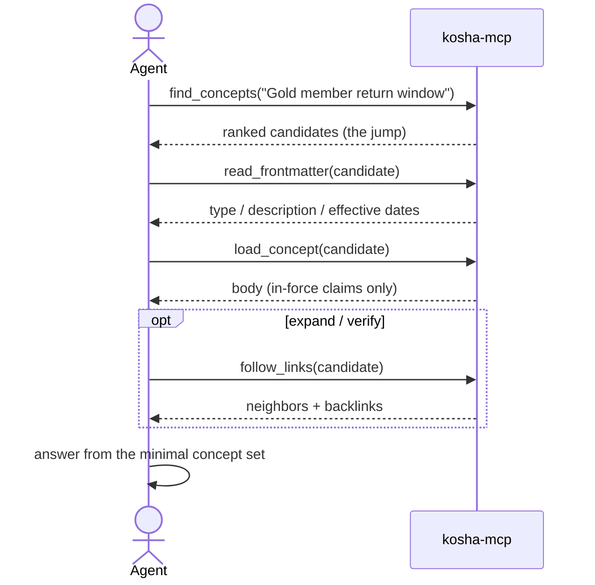

# MCP integration

Kosha's consumer surface is a traversal-only MCP server. It exposes a fixed set of tools that walk the bundle — and deliberately **no raw-text search endpoint** — so an MCP client can answer through traversal rather than grepping the file tree. This is an interface boundary: a host agent that also has generic filesystem tools is not sandboxed by Kosha today.

## Running the server

The `kosha-mcp` entry point starts a stdio MCP server over one bundle. It needs the `mcp` extra, which `uv sync` already installs.

```bash
# bundle as an argument
uv run kosha-mcp bundles/northwind

# or via the environment
KOSHA_BUNDLE=bundles/northwind uv run kosha-mcp
```

On start it loads the bundle, builds the embedding index (for the jump), and serves the registry tool surface over stdio. With neither an argument nor `KOSHA_BUNDLE`, it exits with a usage message.

## The traversal tools

Inside the MCP surface, these tools are the way to read the knowledge base. They mirror the hybrid retrieval path: **jump** near the answer, then **traverse** to expand and verify. Registry-mode signatures include `bundle_id`; the default `kosha-mcp` entry point serves the configured bundle as `default`.

<!-- kosha:sync:start mcp-tool-table -->
| Tool | Signature | Returns |
|---|---|---|
| `list_bundles` | `()` | List bundles visible to the caller's configured clearance, with revision |
| `list_index` | `(bundle_id: str, scope: str = '')` | List a bundle directory's direct contents (subdirectories + concepts) |
| `read_frontmatter` | `(bundle_id: str, concept_id: str)` | Read a concept's frontmatter without its body |
| `load_concept` | `(bundle_id: str, concept_id: str, asof: str \| None = None)` | Load a concept's body, showing only the claims currently in force |
| `find_concepts` | `(bundle_id: str, query: str, k: int = 3)` | Jump to concepts within one addressed bundle, never across bundles |
| `follow_links` | `(bundle_id: str, concept_id: str)` | List a concept's links and backlinks so you can traverse the graph |
| `claim_history` | `(bundle_id: str, concept_id: str, claim_id: str \| None = None)` | Show a concept's claim lineage: full audit trail, or one claim's chain |
<!-- kosha:sync:end -->

### The intended flow



`list_index` is available for cold navigation and audit when the agent prefers structured traversal over the jump.

## Connecting a client

Any MCP client that can launch a stdio server works. Register `kosha-mcp` as the command. Example for a Claude Desktop-style `mcpServers` config:

```json
{
  "mcpServers": {
    "kosha": {
      "command": "uv",
      "args": ["run", "kosha-mcp"],
      "env": { "KOSHA_BUNDLE": "/abs/path/to/bundles/northwind" }
    }
  }
}
```

Point `command`/`args` at however you invoke the installed entry point in your environment (e.g. an absolute path to `kosha-mcp`), and give `KOSHA_BUNDLE` an absolute path. The server's tool list will appear as `list_bundles`, `find_concepts`, `list_index`, `read_frontmatter`, `load_concept`, `follow_links`, and `claim_history`.

The server also advertises instructions telling the agent to answer by traversal, jump with `find_concepts`, peek with `read_frontmatter`, load only what it needs, inspect claim lineage with `claim_history` when an audit trail matters, and treat the traversal tools as the only knowledge interface.

## Temporal validity

`load_concept` filters to the claims **in force now** by default: a claim whose `effective_to` has passed is hidden. Pass an ISO timestamp as `asof` to answer historical questions ("what was the policy in Q1"):

```text
load_concept("policies/returns/gold-members", asof="2026-01-15T00:00:00Z")
```

This is how one concept carries history without forking files — see [authoring bundles](authoring-bundles.md#temporal-validity).

## Access control (bundle-level)

Access is enforced at the **bundle level** — the bundle is granted or denied as a whole; there is no concept-level ACL (a deliberate v1 choice that keeps the "just files" portability story; see [system design §6](system_design.md)). The `KoshaKnowledgeService` accepts a required `bundle_access` label and a caller `clearance` set; when `bundle_access` is set, only a caller whose clearance contains it is served, otherwise every read raises an access error.

The `kosha-mcp` entry point reads both from the environment:

```bash
KOSHA_BUNDLE=bundles/northwind \
KOSHA_BUNDLE_ACCESS=confidential \
KOSHA_CLEARANCE=confidential,ops \
uv run kosha-mcp
```

- `KOSHA_BUNDLE_ACCESS` — the label this bundle requires. Unset (the default) serves the bundle openly, matching prior behavior.
- `KOSHA_CLEARANCE` — comma-separated labels the served caller holds. Setting `KOSHA_BUNDLE_ACCESS` without `KOSHA_CLEARANCE` denies every caller rather than silently serving the bundle open — clearance must be granted explicitly.

To enforce access with logic more complex than a static label set (e.g. per-request identity), embed the service in your own server process instead:

```python
from pathlib import Path
from kosha.okf.load import load_bundle
from kosha.index.embedding import EmbeddingIndex
from kosha.providers import resolve_embedding_provider
from kosha.mcp.service import KoshaKnowledgeService
from kosha.mcp.server import build_server

bundle = load_bundle(Path("bundles/northwind"))
index = EmbeddingIndex.build(bundle, resolve_embedding_provider())
service = KoshaKnowledgeService(
    bundle, index, bundle_access="support-team", clearance={"support-team"}
)
build_server(service).run()
```

To keep some knowledge out of an agent's reach today, put it in a **separate bundle** with its own permission boundary rather than relying on per-file hiding.

## Without MCP: the fallback contract

Not every environment has MCP. The same traversal protocol ships as paste-in instructions so an agent can follow the same no-grep, load-minimal, temporal discipline against the files directly:

- **`AGENTS.md` fragment** — [`consumer/AGENTS.fragment.md`](../consumer/AGENTS.fragment.md). Paste into the consuming repo's `AGENTS.md`.
- **Skill** — [`consumer/kosha-traversal/SKILL.md`](../consumer/kosha-traversal/SKILL.md). Drop into an agent's skill directory.

Both are generated from a single source of truth (`kosha.mcp.fallback`), so the file-based protocol stays aligned with the bundle traversal surface. `list_bundles` remains server-only because a pasted fragment applies to the bundle repository it is installed in. The rules in either case:

- **Do not grep, ripgrep, or full-text search** the bundle — traverse from `index.md` (and the embedding jump).
- **Do not load the whole corpus** — stop as soon as the loaded concepts answer the question.
- Honor temporal validity and access; cite the `concept_id`s used.
