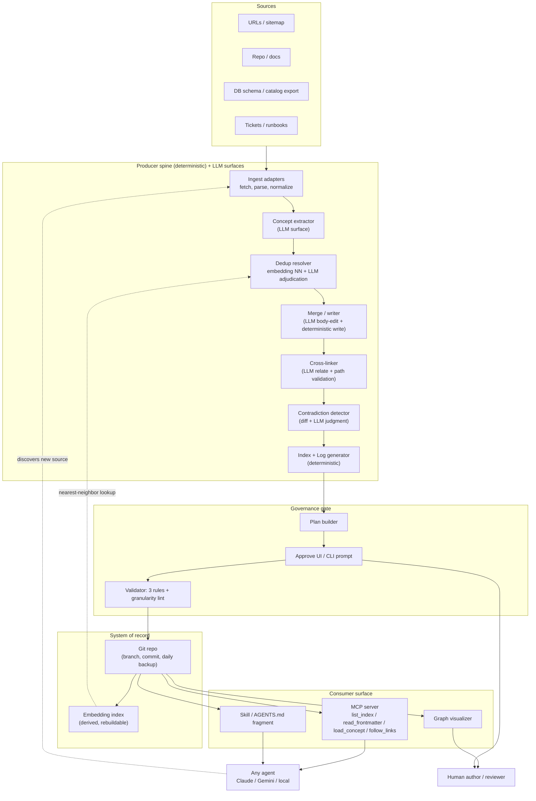
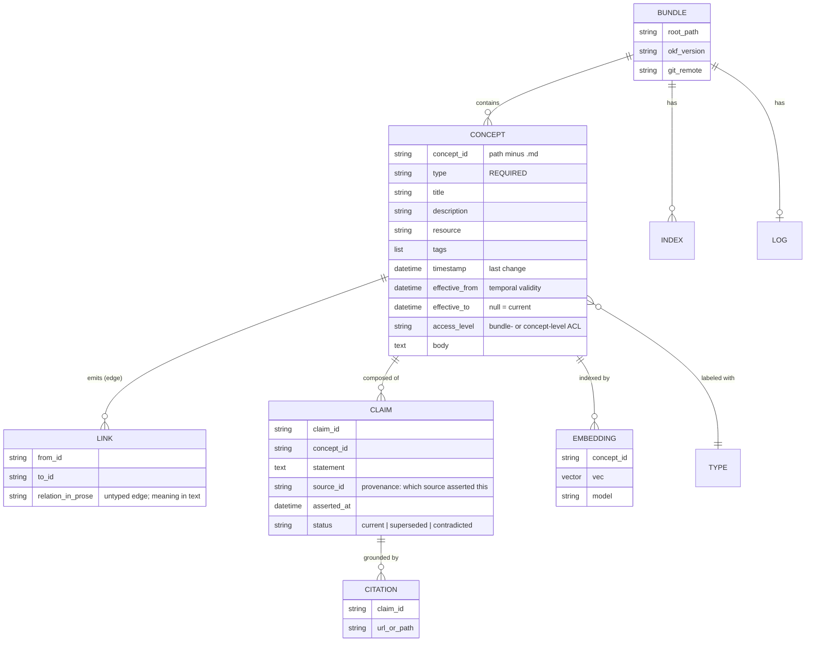
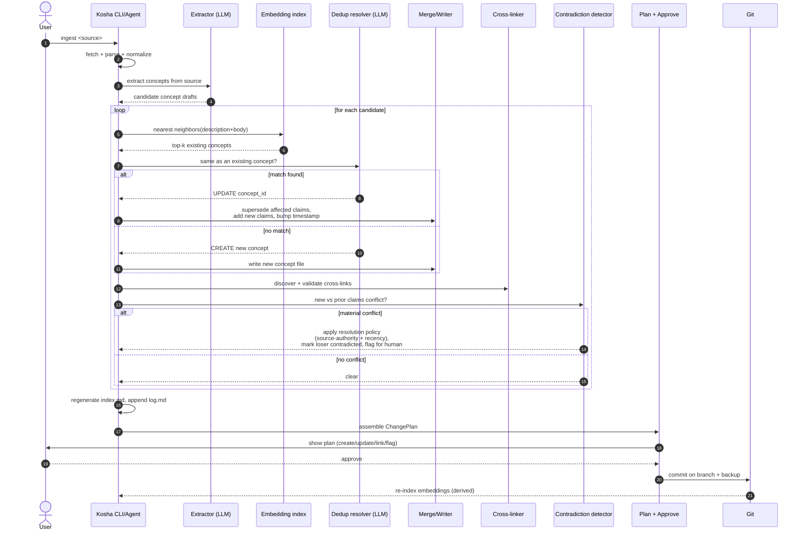
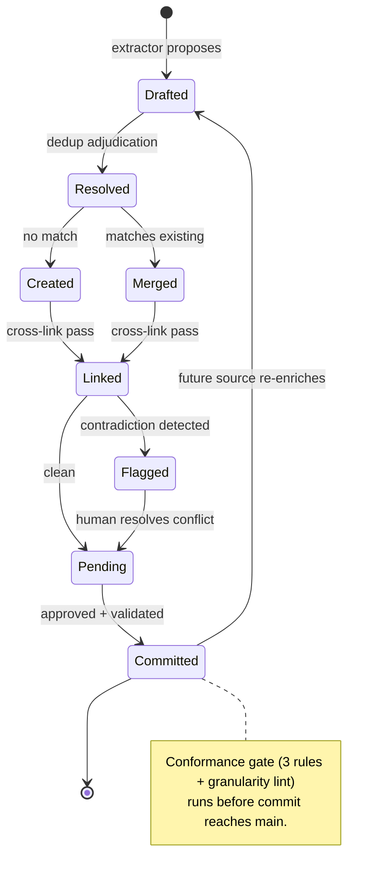
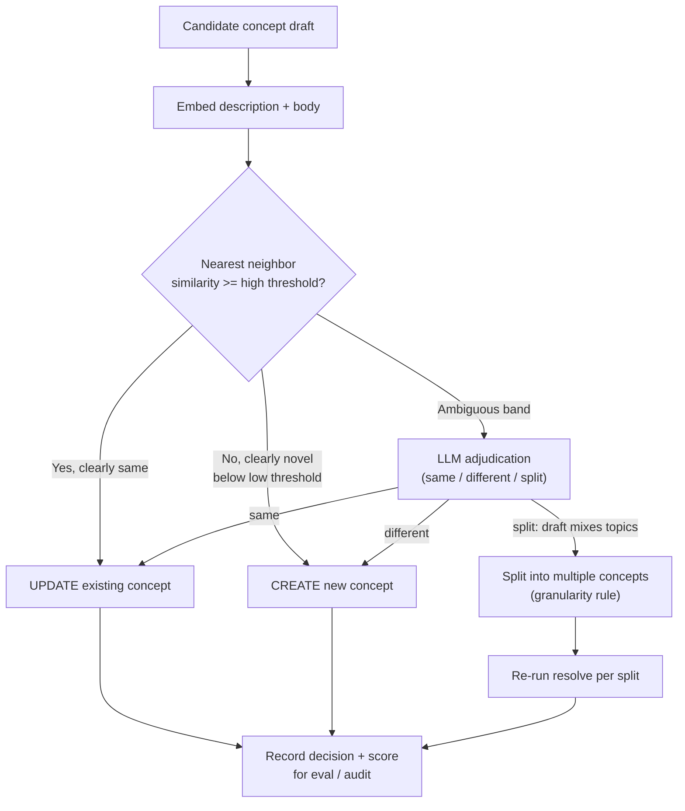
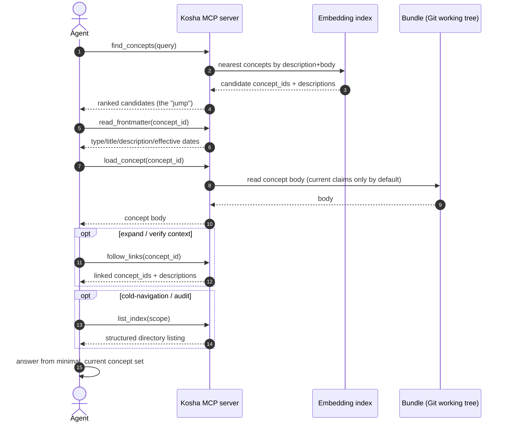
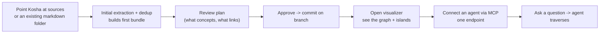
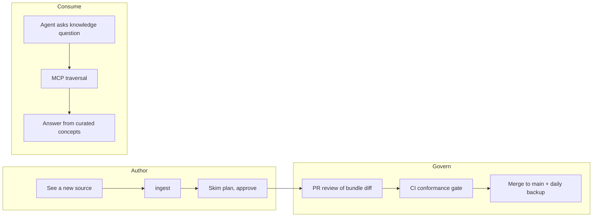

# Kosha — System Design

## 1. Design principles

These are non-negotiable constraints that shape every component below.

| Principle | Consequence in the design |
|---|---|
| **Deterministic spine, isolated LLM surfaces** | Code owns control flow, file I/O, conformance, and traversal. The LLM is called only for contained judgments (extract, dedup-adjudicate, merge-body, relate, contradict), each behind a typed interface and an eval. |
| **The artifact is open and self-sufficient** | Output is plain OKF files in the user's Git repo. Kosha can be removed and the bundle still works in any editor/agent. No proprietary store on the critical path. |
| **Traversal-first consumer surface** | Retrieval is exposed as explicit MCP tools so an agent traverses the bundle; fallback instructions encourage the same path, but only a future sandboxed serving boundary can prevent a host session from using generic filesystem search. |
| **Every write is reviewable** | Writes go through a plan → approve → commit gate, on a branch, with a daily backup. No silent mutation of the knowledge base. |
| **Model- and cloud-neutral** | Embeddings and generation sit behind providers; no dependency on a specific model, cloud, or agent framework. |
| **Conformance is a gate, not a guideline** | The 3-rule OKF validator plus a granularity lint run in CI; non-conformant output never reaches `main`. |

Stack baseline (proposed): async Python, Pydantic models for every typed boundary, an embedding index for dedup, Git as the system of record, MCP for the consumer surface, one eval suite per LLM surface.

### 1.1 Architecture fault lines (unresolved decisions that gate whether it *works*)

These are distinct from the strategic risks in the Overview. They don't affect *whether* to build; they decide whether the thing functions at scale. Each is a real tension with no free answer — pick deliberately, early.

| Fault line | The tension | Decision required | Resolved in |
|---|---|---|---|
| **Access control vs openness** | OKF's pitch is "plain files, readable by anything." That structurally fights per-concept RBAC, multi-tenancy, and "hide sensitive concepts" — which every enterprise needs. You cannot easily ACL a flat, portable markdown bundle. | Bundle-level ACL (coarse, keeps the "just files" story, ships fast) **or** concept-level ACL (needs a serving layer that *breaks* portability). | §6 (Deployment & security) |
| **Edit-drift / palimpsest decay** | If a concept body is *re-written* by an LLM on every merge, fidelity degrades across ingests — a telephone game. By ingest #50 the body may reflect no source faithfully. | Append-with-supersede over in-place rewrite; per-claim provenance; ability to reconstruct a concept from cited sources. | §3 (Data model), §4.1 (merge) |
| **Contradiction resolution + temporal validity** | "Flag contradictions" is not a resolution model. And knowledge is time-bound — a policy true in Q1, changed in Q3. Is a concept a snapshot or a history? | A resolution policy (recommend: source-authority rank + effective-dating) and effective/expiry fields in frontmatter. | §3 (Data model), §4.1 |
| **Traversal latency** | The headline win is *fewer tokens*. But traversal is sequential round-trips (index → sub-index → frontmatter → concept → links), each a model call. On a deep tree this can be *slower* (wall-clock) than one RAG hop, even while cheaper in tokens. | Hybrid retrieval: embedding-jump to candidate concepts, then traverse to expand. Pure progressive disclosure is elegant and possibly too slow at depth. | §4.4 (consume), §7.3 (scale) |

---

## 2. Architecture

### 2.1 Container view



### 2.2 Component responsibilities

| Component | Type | Responsibility | Key interface |
|---|---|---|---|
| Ingest adapters | det | Pull a source, parse to normalized text + metadata | `fetch(source) -> RawDoc` |
| Concept extractor | LLM | Propose candidate concepts from a RawDoc | `extract(RawDoc) -> list[ConceptDraft]` |
| Dedup resolver | det + LLM | For each draft, find nearest existing concepts (embedding), then adjudicate same/different | `resolve(ConceptDraft, EmbIndex) -> Resolution` |
| Merge / writer | LLM + det | Apply create/update to concept bodies; bump timestamps; write files | `apply(Resolution) -> FileChange[]` |
| Cross-linker | LLM + det | Propose relationships, validate target paths, insert bundle-relative links | `link(Concept, Bundle) -> LinkEdit[]` |
| Contradiction detector | det + LLM | Diff new vs prior claims; flag material conflicts | `check(old, new) -> ConflictReport` |
| Index/Log generator | det | Regenerate `index.md` per directory; append `log.md` | `regen(Bundle) -> FileChange[]` |
| Plan builder | det | Assemble all proposed changes into a reviewable plan | `plan(FileChange[]) -> ChangePlan` |
| Approve UI/CLI | det | Present plan; capture approval | `approve(ChangePlan) -> Decision` |
| Validator | det | 3-rule conformance + granularity lint; CI exit code | `validate(Bundle) -> Report` |
| Git store | det | Branch, commit, backup; system of record | `commit(FileChange[], branch)` |
| Embedding index | det | Derived NN index over concept description+body; rebuildable from Git | `query(vec, k) -> Neighbor[]` |
| MCP server | det | Expose traversal tools to agents | `list_index / read_frontmatter / load_concept / follow_links` |
| Visualizer | det | Force-directed graph + backlinks for humans | static HTML, self-contained |

---

## 3. Data model

### 3.1 Conceptual entities



> **On the CLAIM entity (edit-drift mitigation):** concepts are not just opaque bodies. Kosha tracks the body as a set of provenance-bearing claims so a merge can *supersede* a specific claim (mark old `superseded`, add new) rather than re-write the whole body each time. This keeps fidelity stable across many ingests and lets a concept be reconstructed from its sources. The CLAIM layer is Kosha's internal index; the on-disk artifact stays plain OKF markdown (claims render as body text + a citations section), so conformance and portability are unaffected.

### 3.2 Notes that bind the model to the spec

- `concept_id` is the file path minus `.md`; identity is the path, so a "move" is a rename + link rewrite, not a metadata change.
- Only `type` is required. `description` is treated as *effectively* required by Kosha because progressive disclosure depends on it — the validator emits a lint warning when it's missing, not a failure.
- Links are **untyped directed edges**; the relation lives in the prose. The graph layer reads them as edges and computes backlinks ("cited by") as the reverse.
- `EMBEDDING` is **derived state**, never the source of truth. It is rebuildable from Git at any time; losing it is a re-index, not data loss.
- `index.md` carries no frontmatter except the bundle-root `okf_version`. **Writer guard:** do *not* emit `type:` or other frontmatter into index files, and use **standard markdown links** (`[text](/path/to/concept.md)`) — never Obsidian `[[wikilinks]]`. Both are common conversion mistakes that silently break interop with spec-following consumers; the writer template enforces against them.
- **Temporal validity:** `effective_from` / `effective_to` are Kosha extensions in frontmatter (spec tolerates unknown keys). A consumer answering "what is the policy *now*" filters to `effective_to = null`; a consumer answering "what was it in Q1" filters by date. This is how the same concept carries history without forking files.
- **Access level:** carried per concept; how it's *enforced* depends on the §6 ACL decision. At bundle-level it's metadata; at concept-level it requires the serving layer to filter before handing files to an agent.

### 3.3 Pydantic boundary (illustrative)

```python
from datetime import datetime
from enum import StrEnum
from pydantic import BaseModel, Field

class ClaimStatus(StrEnum):
    CURRENT = "current"
    SUPERSEDED = "superseded"
    CONTRADICTED = "contradicted"

class Frontmatter(BaseModel):
    type: str                                  # required by spec
    title: str | None = None
    description: str | None = None             # lint-required by Kosha
    resource: str | None = None
    tags: list[str] = Field(default_factory=list)
    timestamp: datetime | None = None
    effective_from: datetime | None = None     # Kosha temporal-validity extension
    effective_to: datetime | None = None       # None = currently in force
    access_level: str | None = None            # enforced per the §6 ACL decision
    # producer extensions tolerated and preserved on round-trip
    model_config = {"extra": "allow"}

class Claim(BaseModel):
    claim_id: str
    statement: str
    source_id: str                             # provenance: which source asserted it
    asserted_at: datetime
    status: ClaimStatus = ClaimStatus.CURRENT
    citations: list[str] = Field(default_factory=list)

class Concept(BaseModel):
    concept_id: str                            # path minus .md
    frontmatter: Frontmatter
    body: str
    claims: list[Claim] = Field(default_factory=list)    # provenance index; edit-drift guard
    out_links: list[str] = Field(default_factory=list)   # concept_ids
```

---

## 4. System workflows

### 4.1 Ingest / maintenance loop (the core)



### 4.2 Concept lifecycle (state machine)



### 4.3 Dedup decision (the quality-critical path)



The two thresholds plus an ambiguous middle band keep the LLM call rare (cost) and auditable (every decision logs a score and rationale, feeding the eval set). The `split` branch is where the **one-concept-one-thing** rule is enforced automatically.

### 4.3.1 Contradiction resolution policy (detection is not enough)

Flagging a contradiction without resolving it just defers the problem. Kosha applies a deterministic policy, then escalates only the residue:

1. **Temporal first.** If the new claim has a later `effective_from` and the old one is now expired, the new supersedes; the old is retained with `effective_to` set (history preserved, not deleted).
2. **Source-authority next.** Sources carry an authority rank (e.g. official policy doc > wiki page > chat export). Higher authority wins; the loser is marked `contradicted`, not erased.
3. **Escalate the rest.** If neither resolves it (equal authority, overlapping validity), the conflict goes to the human in the approval plan, with both claims and their provenance shown.

This makes the common cases automatic and reserves human attention for genuine ambiguity — which matters because, at volume, a "flag everything" model collapses into rubber-stamping (see §4.5).

### 4.4 Consume / retrieval path (hybrid: jump, then traverse)

Pure progressive disclosure (root → sub-index → frontmatter → body → links) is elegant but is a chain of sequential model round-trips; on a deep tree its wall-clock latency can exceed a single RAG hop even when it uses fewer tokens. Kosha therefore exposes an **embedding-jump** tool alongside traversal: jump near the answer, then traverse to expand and verify. Traversal remains the integrity mechanism; the jump is the latency mechanism.



Tool set: `find_concepts` (embedding jump), `list_index` (structured traversal), `read_frontmatter`, `load_concept` (filters to `effective_to = null` and access-permitted claims by default), `follow_links`. Exposing these as the MCP knowledge tools makes the served interface traversal-first. The jump keeps latency competitive with RAG on the deterministic reference corpus; traversal + temporal/access filtering keep answers auditable in ways raw search does not.

### 4.5 Graduated autonomy (the approval gate must scale)

"Human approves every write" is the whole safety model — and it breaks at volume: a reviewer facing 200 near-identical proposals stops reading and rubber-stamps, so the gate stops gating. Kosha routes by the same confidence scores the dedup resolver already produces:

| Confidence / impact | Action | Human involvement |
|---|---|---|
| High-confidence, low-impact (new isolated concept, additive claim, link) | Auto-apply on branch | Batched, reviewable after the fact; nothing on the critical path |
| Medium | Apply on branch, surface in the plan | Skim-review before merge |
| Low-confidence **or** contradiction **or** deletion/supersede of a load-bearing claim | Block | Explicit approval required, with provenance shown |

This keeps human attention on the decisions that actually need judgment and prevents the alert-fatigue failure. Thresholds are tunable per bundle; a regulated bundle can force everything to the "block" lane.

---

## 5. User workflows

### 5.1 Onboarding (first bundle)



### 5.2 Day-2 usage



---

## 6. Deployment & integration

| Concern | Choice | Rationale |
|---|---|---|
| Primary form | **Local-first**: CLI + MCP server, operating on a Git repo | Matches anti-lock-in story and a terminal-native workflow; no data leaves the machine by default |
| Optional hosted | Thin SaaS for non-technical onboarding + scheduled re-ingest | Lowers friction for the expansion (consumer) audience without making the core depend on it |
| State of record | Git (branch per ingest, commit per approved plan, daily backup tag) | History, attribution, diffs, rollback — all free |
| Derived state | Embedding index, cached locally, rebuildable | Never authoritative; safe to delete |
| Consumer integration | MCP server (primary); skill + `AGENTS.md` fragment (fallbacks) | MCP presents a traversal-only knowledge interface; fragments cover environments without MCP but remain instructions, not an enforcement boundary |
| CI | Validator as a gate (`exit != 0` blocks merge) | Conformance + granularity enforced before `main` |
| Models | Embedding + generation behind a provider interface | Swap Claude/Gemini/local without touching the spine |
| **Access control** (fault line) | **v1: bundle-level ACL** (a bundle is the permission unit). Concept-level deferred. | Concept-level ACL requires a serving layer that filters before handing files to an agent — which *breaks* the "just files, readable by anything" portability story. Take the coarse option until a customer pays for the fine one, then add it as a serving-layer feature, not a format change. |
| **Source-of-truth stance** (fault line) | **v1: bundle is canonical for what it holds**; living sources are ingested on an explicit cadence, not silently mirrored. | The unresolved-decision trap is pretending one-way ingest stays fresh. Be explicit: either the bundle owns a concept (and the source is a citation) or it's a cache with a stated re-ingest interval. Avoid "yet another silo" by owning a *curated* layer, not duplicating the raw source. |

> **Cost note (maintenance economics).** Each ingest runs several LLM calls (extract, dedup-adjudicate in the ambiguous band only, merge, relate, contradict). The deterministic thresholds in §4.3 exist partly to keep the *paid* LLM calls rare. Model cost-per-ingest explicitly before promising "ingest everything"; cheap models handle extraction/relation, the costlier model is reserved for the ambiguous dedup and contradiction calls.

---

## 7. Cross-cutting concerns

### 7.1 Failure modes & handling

| Failure | Detection | Handling |
|---|---|---|
| Extractor over/under-splits concepts | Granularity lint + dedup `split` branch | Auto-split or merge proposal surfaced in plan |
| Dedup false-merge (collapses two distinct concepts) | Eval suite + confidence score below band → human review | Ambiguous band routes to LLM, then to human if still low-confidence |
| Dedup false-create (duplicate) | Periodic duplicate-rate scan over embeddings | Flag near-duplicate clusters for merge |
| Contradiction silently overwritten | Contradiction detector on every update | Flag in body + log; never silent overwrite |
| Broken cross-link | Validator (warning, not error) | Tolerated by spec; tracked as "not-yet-written knowledge" |
| Spec major-version break | Pinned `okf_version` + conformance suite in CI | Writer adapter updated behind interface |
| Agent ignores OKF and uses generic file search | Current MCP surface omits raw-text search; future sandboxed serving can terminate the agent's filesystem access at Kosha | Today this is an instruction/interface boundary, not a host-level restriction |
| **Concurrent ingests edit the same concept** (multi-writer) | Branch-per-ingest; Git detects overlapping edits | Code merges auto-resolve; prose bodies do not. Serialize writes per concept via a lightweight lock, or queue ingests; on true conflict, surface both edits to the human rather than last-write-wins |
| **Edit-drift / palimpsest decay** (repeated LLM body rewrites lose fidelity) | Claim-level provenance diff across versions; periodic reconstruct-from-sources check | Supersede claims instead of rewriting bodies (§3, §4.1); a concept must remain reconstructable from its cited sources |
| **Approval rubber-stamping at volume** | Volume + approval-latency metrics | Graduated autonomy (§4.5): auto-apply high-confidence, reserve humans for ambiguity/conflict |

### 7.2 Security & privacy

- **Local-first by default**; the visualizer embeds the bundle and runs with no backend (no data egress on the consume side).
- Source ingestion of authenticated/internal material runs under the user's own credentials; Kosha stores no source credentials beyond the session.
- Cross-org bundle *exchange* has **no trust/provenance layer in OKF v0.1** — treat third-party bundles as untrusted input; do not auto-merge external bundles into an internal one without review. (This is also why the "buy/sell bundles" marketplace is a v2 concern, not v1.)
- **Concept-level confidentiality is not a property of the format.** A bundle on disk is readable by anything that reads files. If an agent must be denied specific concepts, that filtering happens in the serving layer (the MCP server enforcing `access_level`), not in the files — which is the §6 access-control fault line. Until concept-level ACL ships, keep sensitive knowledge in a *separate* bundle with its own permission boundary rather than relying on per-file hiding.

### 7.3 Scale & performance

- **Token cost** is bounded by traversal depth, not corpus size — the design goal. Index files keep per-step listings small; only leaf concepts are fully loaded.
- **Latency is the honest weak point.** Pure traversal is sequential model round-trips; on a deep tree, wall-clock latency can exceed a single RAG hop even when token count is lower. The hybrid path (§4.4) — embedding-jump to candidates, then short traverse — is what keeps latency competitive. Do not claim "faster retrieval" on traversal alone; claim it on the hybrid, and measure both token and wall-clock against RAG and against long-context-with-raw-docs (see §8 spike).
- **Ingest cost** scales with *new* source volume, not total corpus, because dedup means most ingests are small surgical edits, not re-indexes.
- Embedding index is the main scaling component; local, derived, shardable by subtree if a bundle grows very large.

---

## 8. MVP cut (what to build first)

### 8.0 Step zero: Premise-Validation spike (gating — do this before any build)

Three premise risks (Overview R9, R12, and the traversal-latency fault line) can each invalidate the headline benefit, and none requires building the product to test. Run a 1–2 week spike first; if it fails, redesign the value prop or stop.

| Question | Experiment | Kill signal |
|---|---|---|
| Does structured retrieval still win? | On a realistic corpus, compare answer quality, **token cost, and wall-clock latency** across: (a) Kosha hybrid retrieval, (b) RAG, (c) long-context with raw docs. Run at *current* model prices. | If long-context-with-raw-docs matches on quality at acceptable cost/latency, the token-saving wedge is gone — re-anchor on coherence/governance or stop. |
| Is traversal fast enough? | Measure latency of the hybrid path vs pure traversal vs single RAG hop on a deep (4–5 level) bundle. | If hybrid isn't within a usable margin of RAG, the retrieval design needs rework before anything else. |
| Is the loop better than a prompt? | Have an existing coding agent + a good `AGENTS.md` maintain concept files on the same source stream; compare duplicate-rate and dedup quality vs Kosha's loop. | The current real-model answer is NO-GO: the loop does not beat a good prompt on measured decision-quality axes. Reopen only with a future pre-registered GO. |
| Where does eval data come from? | Build the first golden dedup/granularity set (synthetic pairs + human adjudication) and size the effort. | If labeling is intractable at the needed scale, the quality moat is unprovable — rethink the moat. |

The original deterministic premise spike cleared its local-provider checks. Later real-model Gate-0 runs did not clear the product-quality bar, so the build below is governance-skill scope unless a future Gate-0 run records a GO.

### 8.1 Build cut

Aligns with the governance-skill boundary in the Overview (maintenance loop + traversal-first consumer surface), deliberately skipping the commoditized parts.

| Build | Skip for now |
|---|---|
| Ingest (URL + local markdown folder) | DB/BigQuery adapters (Google already covers; add later) |
| Concept extractor + **dedup resolver** (the differentiator) | Marketplace / cross-org trust |
| Merge/writer with **claim-level supersede + provenance** (edit-drift guard) | Concept-level ACL (bundle-level only in v1) |
| Cross-linker + index/log regen + **writer conformance guards** (no index frontmatter; standard md links) | Hosted SaaS |
| **MCP consumer server**: `find_concepts` (jump) + `list_index`/`read_frontmatter`/`load_concept`/`follow_links` (traverse) | Fancy multi-tenant governance |
| Temporal fields (`effective_from`/`to`) + contradiction resolution policy | — |
| **Graduated autonomy** approval routing (not approve-everything) | Rich web approve UI (CLI first) |
| Validator (3 rules) + granularity lint + CI gate | — |
| Plan-approve CLI + Git branch/commit/backup | Custom visualizer (reuse Google's) |
| Benchmark harness + golden Northwind corpus (from the spike), one eval suite per LLM surface | — |

Success criterion for the MVP is measurable, not vibes: on a reference corpus, demonstrate **lower token cost _and_ competitive wall-clock latency vs RAG** (hybrid path, not pure traversal), **near-zero duplicate concepts** after repeated ingests, **fidelity preserved across ≥20 sequential ingests** (no edit-drift), and **contradictions resolved-or-escalated, never silently overwritten**.
